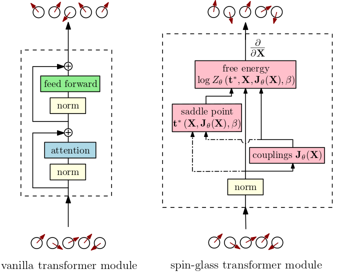

# Spin-glass transformers in JAX

</img>

**Blog post: [Spin-Glass Transformers: A Physics-Inspired Class of Transformer Modules"](https://mcbal.github.io/)** [](https://colab.research.google.com/)


## Install

```bash
$ pip install -e .
```

## Usage

```python

```

# References

```bibtex
@article{bal2022spinglasstransformers,
  title   = {Spin-Glass Transformers: A Physics-Inspired Class of Transformer Modules},
  author  = {Bal, Matthias},
  year    = {2023},
  month   = {January},
  url     = {https://mcbal.github.io/}
}
```